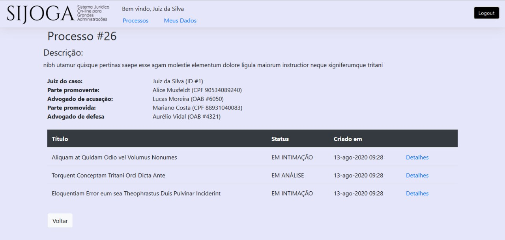

<h1 align="center">
  :balance_scale:: SIJOGA & SOSIFOD - Judicial Systems
</h1>

- **Project proposed by:** college assignment
- **Project developed by:** [Julio L. Muller](https://github.com/juliolmuller) and other [3 contributors](https://github.com/juliolmuller/sistemas-dac/graphs/contributors)
- **Released on:** Jul 25, 2020
- **Updated on:** Jul 25, 2020
- **Latest version:** 0.1.0
- **License:** MIT

Judicial systems developed on Jakarta EE as part of college assignment. The objective was to develop 2 separate systems using the frameworks JSF and Hibernate to practice these technologies as well as the integration among them, using REST API.

## :trophy: Lessons Learned

- Worked with Maven projects;
- Experienced CDI and EJB technologies;
- Integrated front and back end with JavaSever Faces framework, using managed beans, validators, converters and XHTML;
- Integrated Hibernate persistence framework within web applications;
- Created REST API with JAX-RS for data exchange through applications;
- Created HTTP client to consume the web service;
- Experienced with Jakarta EE Security API;

## :hammer: Technologies & Resources

**Frontend:**
- Bootstrap 4 (for styling)
- jQuery (for DOM manipulation and AJAX)
- JSF 2 components

**Backend:**
- JDK 1;8
- PostgreSQL 11/12
- GlassFish Server 5.1 (Jakarte EE 8 implementation)
- JSF 2.3
- Hibernate 4.3
- Jasper Reports 6

**Development:**
- Apache NetBeans 11.3
- Apache Maven (NetBeans integrated)

## :zap: Features

- Authentication;
- Multiple authorization roles: Judge, Lawyer and Party (in SIJOGA); and Officer and Admin (in SOSIFOD);
- Auto sign-up for lawyers and judges;
- Data validation;
- PDF reports (in SIJOGA);
- Friendly and intuitive UI;

## :bell: Setting up the Environment

To run any of the applications of this project, besides the development resources and JDK listed above, you will need to configure the `hibernate.cfg.xml` file with your local  database information in BOTH systems, since they are completely separate and running in different database instances. To do that, access `[project]/src/main/resources/` and create a copy of file `hibernate.cfg.xml.example` renaming it as `hibernate.cfg.xml` (without the **.example**), and update this copy with your local connection information.

Hibernate is configured to create the database schema whenever the application is deployed, so don't worry about running SQL scripts besides the `CREATE DATABASE`.
